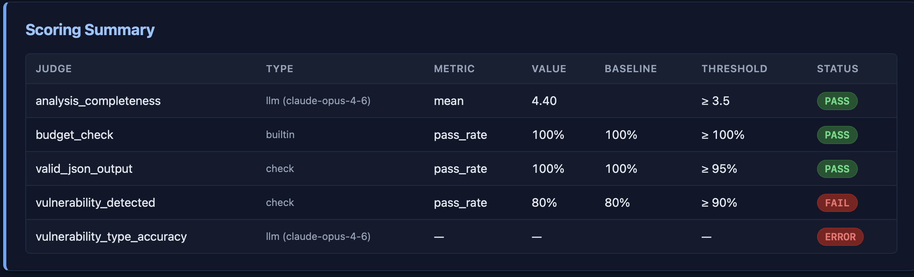

# Skills Testing

## Research Questions
1. How can we benchmark the effectivenes of Skills?
2. If we plan to use security skills to meet security goals in the Agentic Development Life Cycle (ADLC), how reliable are they?

## Definitions

* Skills
    * A self-contained unit of capability: a combination of instructions (typically in a SKILL.md file), scripts, and resources that an AI agent can discover and execute to perform a specific task.
    > Think of it as a modular plugin for an AI agent's toolbox.
* Harness
    * Execution Harness
        * Also known as an agent harness or agent runtime, this is the code that turns a static language model into an active, decision-making agent. It manages the state machine and the loop of interaction.
    * Evaluation Harness
        * This is a specific framework. It sits entirely separate from the live agent system to test its capabilities.

## Resources

* [Agent Eval Harness](https://github.com/opendatahub-io/agent-eval-harness)
    * Generic evaluation framework for agents and skills. Analyze, run, score, and improve skills automatically across different agent harness (Claude Code, OpenCode, Agent SDK).
    * The primary objective of an agent evaluation harness like this one is to measure the performance, reliability, and cost-efficiency of AI agents focusing on their Skills.
    * [My notes on the project](https://github.com/wbenchesser/agent-eval-harness-testing)
* [Cloudflare Vulnerability Scanning: Skills](https://blog.cloudflare.com/build-your-own-vulnerability-harness/#it-all-starts-with-a-skill)
    * "The real value lives in the prompts themselves, and our prompts continue to carry the initial skill's attacker scenarios, bug classes, and anti-pattern detections nearly unchanged."
    * Supports the use of more agents. Agents with different roles doing precise, individualized tasks have good results. 
    * This team used:
        * Three "researchers"
            * Do recon and write an architecture.md
        * One "hunter" per attack class 
            * Trying to break the code rather than review it.
        * Adversarial Validators
            * Attempt to disprove each finding. 
            * survivors are written up as a human-readable vulnerability report.
        * A fresh agent independently re-verifies every finding against the source.
    * One of the big takeaways is that when looking at the coverage metrics, a single run finds only about half the bugs you'd catch across multiple runs. The ones that are found tend to be skewed toward the simpler and less subtle.
* [The ProdSec Skills Reposoitory](https://github.com/RedHatProductSecurity/prodsec-skills)
    * Security skills for AI coding assistants and agentic systems. Skills encode security recommendations, guidelines, and best practices.
        
## Benchmarking
* What does it mean to benchmark a skill? Unlike standard prompt engineering, you are testing two distinct capabilities:
    1. **Intent Recognition**: did the agent trigger the skill at the right time?
    2. **Procedural Execution**: did the agent execute the workflow consistently and efficiently?

### Possible Metrics
1. **Trigger Accuracy (Activation Rate)**: 
    * Since agents use progressive disclosure (reading the YAML frontmatter to determine if a skill is relevant), you must measure how reliably it triggers.  
    * Target: >90% activation on relevant queries; 0% activation on completely unrelated queries (false positives).
2. E**xecution Consistency (Determinism)**: 
    * One of the primary goals of a skill is repeatability. If you pass the same input multiple  times, does the layout, tone, and file structure remain uniform?  
3. **Orchestration Efficiency**: 
    * If a skill coordinates with the [Model Context Protocol](https://modelcontextprotocol.io/docs/getting-started/intro) (MCP) or external tools, track the number of tool calls. A high-performing skill drops the number of exploratory actions or errors an agent makes.
4. **User Correction Rate**: 
    * How often does a human have to intervene with statements like "No, follow step 3" or "You forgot the style guide"? 
    * A successful skill drops human course-correction to near zero.

## Approach

Any project wishing to address the research questions will need to focus on measuring the effectiveness of skills both in isolation and when used at scale in the ADLC. The approach should consist of the following key components:

1. **Isolated Skill Testing**: Evaluate individual skills in controlled environments to establish baseline performance metrics for trigger accuracy, execution consistency, orchestration efficiency, and user correction rates.

2. **ADLC Integration Testing**: Deploy skills within the full ADLC workflow to measure their effectiveness in realistic development scenarios, including how they interact with other skills and tools.

3. **Vulnerability-Based Benchmarking**: Explore the feasibility of benchmarking skill effectiveness against a curated set of known vulnerabilities. This will involve:
   * Drawing from established sources like the OWASP security benchmark and other vulnerability databases
   * Identifying existing projects with documented security issues
   * Creating test scenarios where security skills should detect and address these known vulnerabilities
   * Measuring detection rates, false positives, and remediation quality

4. **Comparative Analysis**: Assess the reliability and accuracy of security skills by comparing their performance against known vulnerability baselines, establishing confidence intervals for their use in production security workflows.

## Specific Tests

In order to benchmark effectiveness, we'll want relevant code snippets that we as developers know should be handled by certain skills. Here are some matchups I've found:

1. ProdSec's input-validation-injection
    * Applied when reviewing or writing code that processes untrusted input, constructs queries or commands, or handles user-supplied data. Covers SQL, LDAP, OS command injection, prototype pollution, and general validation strategy.
    > The OWASP benchmark has vulnerability examples relating to SQL Injection, LDAP Injection, Command Injection, and Prototype Pollution. 
2. ProdSec's web-application-security
    * Reviews web application security controls against OWASP-aligned risks. Use when building, auditing, or reviewing server-side web applications that handle user input, sessions, authentication, or access control.
3. ProdSec's differential-review
    * Performs security-focused differential review of code changes (PRs, commits, diffs). Adapts analysis depth to codebase size, uses git history for context, calculates blast radius, checks test coverage, and generates comprehensive markdown reports. Automatically detects and prevents security regressions.
    * Meta-skill that should detect security regressions across categories

## Results
I used the agent-eval-harness to test ProdSec's input-validation-injection skill on a 53 test-case subset of relevant OWASP benchmarks. The Scoring Summary is displayed below.

### Takeaways
1. Key Successes & Strengths
    * SQL Injection Detection (Score: 5.0/5.0)
        * **Status:** Production-ready; serves as the gold standard for other vulnerability types.
        * **Why it succeeded:** Provided specific code examples (`PreparedStatement`), clear data flow tracing, concrete line number identification, and actionable fixes.
        * **Judge Feedback:** > "demonstrates thorough understanding of the partial parameterization anti-pattern"
    * Data Flow Analysis (Score: 4.0 - 5.0)
        * **Status:** Core analytical framework is working correctly.
        * **Why it succeeded:** Consistently tracked tainted input from source to sink. Successfully recognized complex indirection patterns (e.g., HashMaps, List manipulation, Base64 encoding).
        * **Judge Feedback (case-003):** > "step-by-step walkthrough of the list manipulation... is precise and accurate"

2. Gaps & Vulnerabilities
    * XSS Detection Failure (Score: 4.0 Completeness / 0% Detection)
        * **Status:** Failed to detect the vulnerability (the only complete detection failure).
        * **Root Cause:** Claude correctly identified ESAPI encoding but falsely concluded "no vulnerability."
        * **Next Steps:** Investigate `case-003` Java code to determine if the test case is mislabeled or if context-specific encoding scenarios are breaking the skill's logic.

3. Evaluation & Methodology Insights
    * Precision vs. Recall
        * **Metrics:** 80% detection rate (4/5 cases), 0% false positives reported.
        * **Takeaway:** The skill is highly conservative. It avoids alert fatigue (high precision) but under-detects in certain categories like XSS (low recall).
    * Sample Size
        * For testing purposes the sample size was low. Important next step will be increasing to see fewer impacts of statistical noise.

4. Meta-Takeaway: The Eval Harness Works
    * The evaluation infrastructure is highly reliable. Judges are objective, consistent (all 4.0s cited the exact same gap), and specific. **We can trust these scores to accurately guide iteration.**